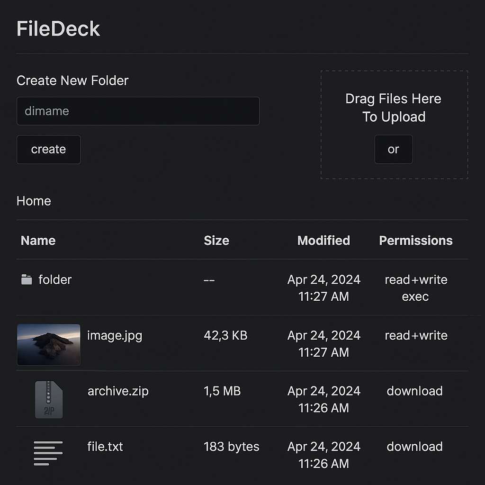

# 📁 FileDeck

**A modern, single-file PHP file manager**  
Minimalistic. Secure. Dark themed. Fully self-contained.



---

## 🔥 Features

- 🧩 **Single PHP File** — Just drop it in your server and run.
- 🔐 **Optional Password Protection** — Quick session-based login.
- 🌑 **Dark Mode UI** — Sleek and modern styling.
- 📂 **Directory Browsing** — List, navigate, create, delete folders.
- 📸 **Image Preview** — Auto-previews JPEG, PNG, GIF, and WebP files.
- 🔼 **Drag & Drop Uploads** — Upload multiple files at once.
- 📦 **Zip Download** — Compress folders/files and download instantly.
- 🧼 **Clean Interface** — Minimal JS, no dependencies beyond jQuery.

---

## 🚀 Getting Started

### 🖥️ Deploy

1. Upload `filedeck.php` to any folder on your PHP-enabled web server.
2. Open it in your browser.

> **Requirements**: PHP 7.4+ (with `ZipArchive`, `fileinfo`, `session`, `json` enabled)

---

## 🔐 Security

- Paths are sandboxed to the root directory where the script resides.
- Uploads and deletions are limited to writable directories.
- Optional CSRF and session-based login built-in.
- XSS and injection safe (inputs are sanitized and scoped).

To enable login:

```php
$LOGIN_ENABLED = true;
$PASSWORD_HASH = password_hash('your-password', PASSWORD_DEFAULT);

